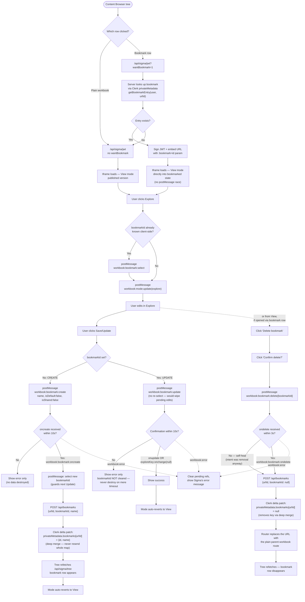

# Embed Success — Sigma Embed Example Site

A production-ready example of embedding [Sigma Computing](https://sigmacomputing.com) analytics into a modern SaaS application. Built with Next.js, Tailwind CSS, Clerk auth, and JWT-based secure embedding.

**Live site:** https://embedexamplesite.vercel.app

---

## What this is

This site demonstrates how to embed Sigma workbooks inside a custom web application using Sigma's JWT embedding API. It includes:

- A polished dark SaaS landing page
- Clerk-authenticated login (email/password, social, or SSO)
- A dashboard shell that loads Sigma content inside an iframe
- Server-side JWT generation — the embed URL is signed fresh on every request
- A multi-embed pattern so you can add new Sigma workbooks with minimal code
- A **Content Browser** — a live sidebar tree, read via the Sigma REST API, scoped to exactly what the logged-in embed user can access
- **Bookmarks** — embed users can Explore a workbook, save their own view as a bookmark, and return to it later, all driven by the Embed SDK's inbound/outbound events
- A public, no-sign-on anonymous embed page (`/interested`)

This is not a template or a starter kit — it's a working demonstration of a real embed architecture, including the rough edges (timing races, event quirks) you actually hit integrating with Sigma's embed SDK and their real-world behavior.

---

## Architecture

```
Browser
  │
  ├── /dashboard/layout.js
  │     └── Clerk middleware verifies session → DashboardChrome
  │           (global chrome: top nav + JWT inspector)
  │
  ├── GET /dashboard
  │     └── Use-case gallery — pick what to demo (lib/use-cases.js)
  │
  ├── GET /dashboard/legacy/[slug]  ·  /dashboard/legacy/browse/[urlId]
  │     └── Legacy Examples — real bookmarkable routes, with this use case's
  │           own sidebar (example switcher + Content Browser) from
  │           app/dashboard/legacy/layout.js
  │
  ├── GET /api/sigma/jwt?mode=<mode> | ?urlId=<urlId>&wantBookmark=1
  │     └── Server verifies Clerk session → signs JWT with SIGMA_SECRET
  │           └── Returns signed embed URL (+ :bookmark param if requested)
  │                 → iframe renders Sigma content
  │
  └── GET /api/sigma/tree
        └── Server reads the EMBED workspace via the Sigma REST API,
              scoped to the logged-in user's Sigma member grants
              → Content Browser sidebar tree
```

**Why server-side JWT signing matters:** The Sigma embed secret never leaves the server. The browser only ever receives a signed, expiring URL — it cannot forge or extend its own access.

---

## Tech stack

| Layer | Technology |
|---|---|
| Framework | Next.js (App Router) |
| Auth | Clerk (`@clerk/nextjs`) |
| Styling | Tailwind CSS + Inter font |
| JWT signing | `jose` (HMAC-SHA256) |
| Bookmark storage | Clerk `privateMetadata` (per user, no separate database) |
| Hosting | Vercel (auto-deploys on push to `master`) |

---

## Environment variables

Set these in Vercel (Settings → Environment Variables) or in `.env.local` for local development. See `.env.example` for the full annotated list. Key groups:

```env
# Sigma embed credentials — Sigma Admin → Developer Access → Embedding
SIGMA_CLIENT_ID=
SIGMA_SECRET=

# Default embed URL — the Sigma workbook/page to embed (without ?:embed=true)
SIGMA_BASE_URL=

# Content Browser (REST API) — reads the EMBED workspace tree.
# The REST API host for your org's cloud/region — NOT the embed workbook URL.
#   EU AWS:  https://api.eu.aws.sigmacomputing.com
#   US AWS:  https://aws-api.sigmacomputing.com
#   GCP:     https://api.sigmacomputing.com
SIGMA_API_BASE_URL=
# Optional: dedicated REST API OAuth client (falls back to SIGMA_CLIENT_ID/SECRET
# above if the same Developer Access client is API-enabled).
# SIGMA_API_CLIENT_ID=
# SIGMA_API_SECRET=
# Optional: workspace name to browse (default "EMBED")
# EMBED_WORKSPACE_NAME=EMBED

# Clerk — https://dashboard.clerk.com
CLERK_SECRET_KEY=
NEXT_PUBLIC_CLERK_PUBLISHABLE_KEY=

# Add one per new use-case page (see "Adding a new use-case page" below).
# Example: { mode: 'sales' } → SALES_SIGMA_BASE_URL
# SALES_SIGMA_BASE_URL=

# Anonymous embed (/interested page) — every visitor maps to one static Sigma user
INTERESTED_SIGMA_BASE_URL=
ANONYMOUS_SIGMA_SUB=anonymous@embedsuccess.com
ANONYMOUS_SIGMA_ACCOUNT_TYPE=anon

# Optional: embed session length in seconds (default 3600, max 2592000)
# SESSION_LENGTH=3600

# Optional Sigma UI controls (uncomment to enable)
# hide_menu=true
# hide_folder_navigation=true
# disable_mobile_view=true
# responsive_height=true
# theme=
# lng=
```

---

## Content Browser & Bookmarks

The **Content Browser** sidebar (below the two static nav examples) is a live folder/workbook tree, fetched from the Sigma REST API and scoped to exactly what the logged-in embed user can access — including access granted via team membership, since `GET /v2/members/{memberId}/files` resolves effective grants server-side. Clicking a workbook opens it via an ad hoc, `urlId`-based signed embed (`lib/sigma-embed.js`), independent of the `{MODE}_SIGMA_BASE_URL` env-var system used by the static nav examples.

**Bookmarks** let an embed user save their own Explore-mode customization of a workbook and return to it later:

- One bookmark per (Clerk user, workbook), stored in Clerk `privateMetadata` — no separate database.
- Opening a bookmark loads it directly via Sigma's `:bookmark` embed URL parameter (baked into the signed URL server-side), rather than a `postMessage` call after load — this avoids a render race where the iframe's own initial paint could beat a delayed `select`.
- **Save** creates a bookmark the first time (`workbook:bookmark:create`), then **Update**s it thereafter (`workbook:bookmark:update`) — visible only in Explore mode, and automatically reverts to View once saved.
- **Delete** is only shown when a workbook was opened via its bookmark row specifically (not the plain workbook), and removes both the Sigma-side bookmark and the Clerk mapping.

**Real-world quirks this integration works around**, worth knowing if you build on this:
- Clerk's `updateUserMetadata` performs a **deep merge** — the only way to remove a nested key is to set it to `null` in a delta patch, not recompute and resend the whole object (an empty `{}` is a no-op for removal).
- This embed doesn't reliably fire the documented `workbook:bookmark:onupdate` outbound event — in practice, `workbook:exploreKey:onchange` (with `exploreKey: null`) is the event that actually confirms a successful update.
- Re-sending `workbook:bookmark:select` immediately before `update` can reload the bookmark to its last-saved state, discarding the very edits you're trying to save — don't re-select right before update if it's already selected.

### Bookmark flow



---

## Adding a new use-case page

Each use case is a real route under `/dashboard`. Global chrome (top nav, JWT inspector) comes from `app/dashboard/layout.js`; anything else — a sidebar, controls, extra panels — belongs to the use case itself, so one demo's furniture never leaks onto another's.

1. **Add the env var in Vercel** — e.g. `SALES_SIGMA_BASE_URL=https://app.sigmacomputing.com/your-org/workbook/...`

2. **Add a route** — `app/dashboard/<slug>/page.js`, fetching the Clerk user and calling `generateSigmaEmbedUrl({ mode: 'sales', ... })` server-side (see `app/dashboard/legacy/[slug]/page.js` for the pattern), then rendering a client view through `components/ConceptDemoPage.js` (see `components/LegacyExampleView.js`). Wrap the body in `components/UseCaseMain.js`, and call `useDashboardChrome().setJwt(...)` / `setPageTitle(...)` so the JWT inspector and breadcrumb pick it up.

3. **Add a card** to `USE_CASES` in `lib/use-cases.js` so it shows up on the gallery.

4. **Need its own sidebar or controls?** Add a `layout.js` beside the page rendering them next to `UseCaseMain` — see `app/dashboard/legacy/layout.js`, which is how Legacy Examples gets its example switcher and Content Browser.

5. **Push to deploy** — Vercel picks up the new env var and route automatically.

The `mode` string maps to `{MODE}_SIGMA_BASE_URL` — so `mode: 'sales'` reads `SALES_SIGMA_BASE_URL`.

---

## Local development

```bash
# 1. Clone
git clone https://github.com/chewie2000/embed_examplesite.git
cd embed_examplesite

# 2. Install dependencies
npm install

# 3. Set up environment
cp .env.example .env.local
# Fill in your Sigma credentials, workbook URL, and Clerk keys

# 4. Run dev server
npm run dev
# → http://localhost:3000
```

Auth is handled entirely by Clerk (`/sign-in`, `/sign-up`) — you'll need a Clerk application and its keys (`CLERK_SECRET_KEY`, `NEXT_PUBLIC_CLERK_PUBLISHABLE_KEY`) for local dev, since the dashboard is behind Clerk's middleware.

---

## Authentication

This demo uses [Clerk](https://clerk.com) for real multi-user auth — not a placeholder. `middleware.js` protects `/dashboard` via `clerkMiddleware`, and the Sigma JWT route reads the authenticated user's email (and optional `sigmaEmail`/`accountType`/`teams`/`userAttributes` from Clerk `publicMetadata`) to build the embed JWT's claims.

Per-user Sigma identity and RLS attributes are set in the Clerk dashboard → Users → [user] → Metadata → Public:

```json
{
  "sigmaEmail": "user@example.com",
  "accountType": "viewer",
  "teams": ["sales", "emea"],
  "userAttributes": { "region": "EMEA" }
}
```

The Sigma embedding architecture itself is auth-agnostic — `lib/sigma-embed.js` and `/api/sigma/jwt` only need an email to place in the `sub` claim, regardless of how the user authenticated. If you'd rather use [NextAuth.js](https://next-auth.js.org) with Okta/Entra directly instead of Clerk, only the session-reading code in the JWT route changes; the signing logic is unaffected.

---

## Moving SIGMA_SECRET to an app server (production recommendation)

In this demo `SIGMA_SECRET` lives in Vercel environment variables — acceptable for a demo, but in production the secret should live on a dedicated signing service, not on the web tier.

### Why

- The web tier (Vercel/Next.js) is publicly reachable. An app server can be locked to internal network only.
- Secret rotation happens in one place without touching your web deployment.
- Multiple front-ends (web, mobile, other products) can share a single signing service.
- The app server can enforce additional business rules (rate limiting, workbook access control) before signing.

### Target architecture

```
Browser
  │
  └── GET /api/sigma/jwt
        │
        └── Next.js server (verifies Clerk session)
              │
              └── POST https://your-app-server/embed/sign   ← SIGMA_SECRET lives here
                    │
                    └── Returns signed embedUrl → iframe renders Sigma content
```

### What changes in the code

Only `lib/sigma-embed.js` needs to change — replace the local `jose` signing with a fetch to your signing service:

```js
// Current: signs locally
const token = await new SignJWT(payload).sign(encodedSecret);

// Production: delegates to app server
const res = await fetch('https://your-app-server/embed/sign', {
  method: 'POST',
  headers: {
    'Content-Type': 'application/json',
    'Authorization': `Bearer ${process.env.SIGNING_SERVICE_TOKEN}`,
  },
  body: JSON.stringify({ email, accountType, teams, userAttributes, baseUrl }),
});
const { embedUrl } = await res.json();
```

Everything else — Clerk auth, the JWT route, the dashboard, RLS via `user_attributes` — is unchanged. The `SIGNING_SERVICE_TOKEN` is a simple shared secret between your Next.js server and the signing service, replacing `SIGMA_SECRET` on the web tier.

---

## Deployment

This repo is connected to Vercel. Every push to `master` triggers an automatic production deployment.

To force a manual deploy:
```bash
npx vercel --prod
```

---

## JWT claims reference

The JWT generated by `/api/sigma/jwt` includes these Sigma claims:

| Claim | Value | Notes |
|---|---|---|
| `sub` | User email | Maps to Sigma user identity |
| `iss` | `SIGMA_CLIENT_ID` | Must match your embed client ID |
| `jti` | `crypto.randomUUID()` | Prevents replay attacks |
| `account_type` | Optional | `viewer`, `creator`, `admin` |
| `teams` | Optional array | Must match team names in your Sigma org |
| `user_attributes` | Optional object | Passed through for row-level security |

See [Sigma JWT Claims Reference](https://help.sigmacomputing.com/docs/json-web-token-claims-reference) for full documentation. Embed URL parameters (`:embed`, `:jwt`, `:bookmark`, UI controls) are separate from the JWT and documented in [Sigma's URL parameter reference](https://help.sigmacomputing.com/docs/special-characters-for-url-parameters).

---

## File structure

```
embed_examplesite/
├── app/
│   ├── api/
│   │   ├── bookmarks/route.js      # GET/POST — per-user bookmark mapping in Clerk privateMetadata
│   │   └── sigma/
│   │       ├── jwt/route.js        # Verifies Clerk session, returns signed Sigma embed URL
│   │       └── tree/route.js       # Content Browser tree via the Sigma REST API
│   ├── dashboard/
│   │   ├── layout.js               # Auth check + DashboardProvider + DashboardChrome
│   │   ├── page.js                 # Use-case gallery (the landing page)
│   │   └── legacy/
│   │       ├── layout.js           # Adds LegacySidebar to every Legacy Examples route
│   │       ├── page.js             # Redirects to the first example
│   │       ├── [slug]/page.js      # The two pre-existing demo pages
│   │       └── browse/[urlId]/page.js  # A workbook opened from the Content Browser tree
│   ├── interested/page.js          # Public anonymous embed page (no sign-on)
│   ├── login/page.js               # Redirects to /sign-in
│   ├── sign-in/[[...sign-in]]/page.js
│   ├── sign-up/[[...sign-up]]/page.js
│   ├── page.js                     # Public landing page
│   ├── layout.js                   # Root layout + Inter font
│   └── globals.css                 # Tailwind base + custom utilities
├── components/
│   ├── DashboardChrome.js          # Global chrome only — top nav + JWT inspector mount
│   ├── UseCaseMain.js              # Main content column each route composes into the body row
│   ├── LegacySidebar.js            # Legacy Examples' own panel — example switcher + Content Browser
│   ├── ConceptDemoPage.js          # Shared template — badge, title, description, docs links, content slot
│   ├── LegacyExampleView.js        # Renders one lib/legacy-examples.js entry through ConceptDemoPage
│   ├── SigmaEmbed.js               # Fetches JWT, renders iframe, bookmark Save/Update/Delete UI
│   ├── ContentTree.js              # Sidebar tree — folders, workbooks, bookmark rows
│   ├── AnonymousEmbed.js           # Embed component for /interested
│   ├── JwtInspector.js             # Dev panel — decoded JWT claims per embed
│   └── ExpiryBadge.js              # Live JWT expiry countdown
├── lib/
│   ├── dashboard-context.js        # Cross-route shared state for the dashboard chrome (JWTs, page title, tree refresh)
│   ├── use-cases.js                # Cards shown on the /dashboard gallery
│   ├── legacy-examples.js          # Config for the two pre-existing demo pages
│   ├── sigma-embed.js              # JWT generation and embed URL construction (incl. :bookmark)
│   ├── sigma-api.js                # Sigma REST API client — org tree, member file grants
│   ├── bookmarks.js                # Bookmark CRUD against Clerk privateMetadata
│   └── embed-url-params.js         # Per-mode URL filter params (from Clerk publicMetadata)
├── middleware.js                   # Clerk middleware — protects /dashboard
└── .env.example                    # Environment variable reference
```
